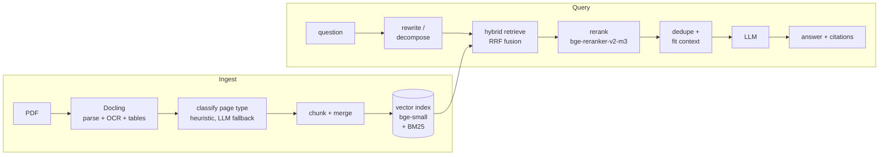
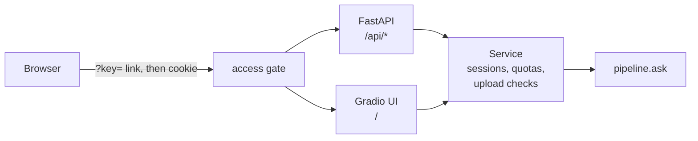

# docuchat

Upload PDFs, ask questions, get answers that cite the page they came from.

> **Status:** done. Ingestion, retrieval, evaluation, the service, UI, and
> Docker image are built and tested. [Try the live demo](#live-demo); it may
> be down, see the note there.

## Why it's built this way

- **Hybrid retrieval, then a reranker.** BM25 and vector search find
  candidates; a cross-encoder decides which ones answer the question. The
  evaluation below shows the reranker is where the quality comes from.
- **Grounded answers.** The model answers only from retrieved context, cites
  file and page, and refuses when the documents don't contain the answer.
- **One config seam.** Every pipeline choice is a field on `Settings`, so each
  ablation arm is a single `dataclasses.replace()` and every result is
  attributable to one change.
- **Measured, not claimed.** A 43-question ground-truth set over 15 public
  CFPB mortgage documents, with bootstrap confidence intervals.

## Architecture



How it's served: one process, one service layer, two front doors.



## Results

Retrieval quality on 43 questions, three arms, each adding one thing to the
last. Brackets are 95% bootstrap confidence intervals.

| arm | hit | recall | MRR | candidate recall |
|---|---|---|---|---|
| baseline (vector only) | 0.632 [0.474, 0.789] | 0.575 [0.430, 0.719] | 0.355 [0.234, 0.483] | 0.706 [0.579, 0.820] |
| +hybrid (add BM25) | 0.605 [0.474, 0.737] | 0.583 [0.439, 0.724] | 0.315 [0.203, 0.448] | 0.829 [0.724, 0.921] |
| +rerank (add cross-encoder) | **0.763** [0.632, 0.895] | **0.715** [0.583, 0.847] | **0.512** [0.379, 0.634] | 0.829 [0.724, 0.921] |

Hybrid search puts the right evidence into the candidate pool more often
(candidate recall 0.71 → 0.83), but on its own it doesn't rank it higher. The
reranker is what turns that pool into better top results: hit rate 0.61 → 0.76
and MRR 0.32 → 0.51. The served app runs the `+rerank` arm. Full output:
[`eval/results/summary.md`](eval/results/summary.md).

### Answer quality

Same 43 questions, answered by Qwen3 8B and graded by Qwen3 14B (both local
GGUFs via llama.cpp, run on a Kaggle T4 with
[`eval/kaggle_eval.ipynb`](eval/kaggle_eval.ipynb)). `full` adds LLM query
rewriting and decomposition on top of `+rerank`; the last two arms swap one
thing in `full`.

| arm | correct | mean correctness (0–2) | faithful | false refusals |
|---|---|---|---|---|
| baseline | 0.698 [0.558, 0.814] | 1.651 [1.488, 1.814] | 0.744 [0.628, 0.860] | 0.211 [0.079, 0.342] |
| +hybrid | 0.698 [0.558, 0.814] | 1.558 [1.326, 1.744] | 0.744 [0.605, 0.860] | 0.158 [0.053, 0.263] |
| +rerank | 0.674 [0.535, 0.814] | 1.581 [1.372, 1.767] | 0.698 [0.558, 0.837] | 0.105 [0.026, 0.211] |
| full (+ query rewrite/decompose) | 0.698 [0.558, 0.837] | 1.628 [1.441, 1.791] | 0.721 [0.581, 0.860] | **0.079** [0.000, 0.184] |
| full, generic profile | 0.721 [0.581, 0.860] | 1.628 [1.419, 1.814] | 0.721 [0.581, 0.860] | 0.105 [0.026, 0.211] |
| full, bge-base embedder | **0.767** [0.628, 0.884] | **1.744** [1.581, 1.884] | **0.814** [0.674, 0.930] | 0.132 [0.026, 0.263] |

Better retrieval mostly shows up as fewer wrong refusals (0.21 → 0.08): with
the evidence in context, the model stops saying "I don't know" when it does.
Correctness stays near 0.70 across the retrieval arms, so at this size the
answering model, not retrieval, is the ceiling. The larger bge-base embedder is
the best arm on every answer metric, but its intervals overlap `full`'s. Every
arm refused every unanswerable question correctly.

Caveats: the judge is a 14B local model, not the frontier-model judge the
design calls for, and it has not been checked against hand labels. Read these
as relative comparisons between arms. Full output:
[`eval/results/judged_summary.md`](eval/results/judged_summary.md).

### Latency

Per-stage p50/p95 for the `+rerank` arm, measured over HTTP against a 4-core
CPU GitHub Codespace with Gemini 3.7 Flash (free tier) as the answering model.
Milliseconds.

| stage | p50 | p95 |
|---|---|---|
| retrieve | 35 | 36 |
| rerank | 3,280 | 3,309 |
| clean_context | 3,090 | 3,119 |
| llm | 12,402 | 19,130 |
| total (server) | 18,863 | 25,535 |
| end-to-end (client) | 18,945 | 25,705 |

A question takes about 19 s, and most of that is the LLM call. On this CPU
host the reranker is swapped for `cross-encoder/ms-marco-MiniLM-L-6-v2` at
512 tokens (two `DOCUCHAT_*` variables, no code change): the default
`bge-reranker-v2-m3` took 125–130 s per question on 4 vCPUs. The quality
numbers above are for the default reranker. This is a small sample, 3 warm
requests after 1 cold one, because the free Gemini tier rejected the rest.
Details: [`eval/results/latency.md`](eval/results/latency.md).

## Live demo

**https://redesigned-sniffle-7jvqgj6qp7vcx97g-7860.app.github.dev/**

Upload a PDF (or use the mortgage corpus) and ask questions about it.

> **It may not work when you try it.** This is a zero-budget project: I can't
> pay for an LLM API key or a host, so the demo runs entirely on free tiers.
> The answers come from Gemini's free tier, which allows about 20 questions
> a day and often returns "high demand" errors. The app runs in a GitHub
> Codespace, which goes to sleep when idle and has limited free hours. If you
> get an error or the page doesn't load, the quota is used up or the
> Codespace is asleep. [Run it locally](#run-it) with your own key and it
> works the same way.

## Run it

Python 3.11+.

```bash
python -m venv .venv && source .venv/bin/activate
pip install -e ".[dev]"
```

Put one LLM key in a `.env` at the repo root (it's gitignored):

```bash
ANTHROPIC_API_KEY=...          # default provider
# or
GEMINI_API_KEY=...
DOCUCHAT_LLM_PROVIDER=gemini
```

Any `Settings` field can be overridden the same way, as `DOCUCHAT_<FIELD>`.

Start the server. The UI is at http://localhost:7860, the API under `/api`:

```bash
uvicorn docuchat.api:app --env-file .env --port 7860
```

Without a key the app still starts and uploads still index; questions answer
"LLM not configured." Set `DOCUCHAT_ACCESS_KEY` to turn on the access gate.

With Docker (models are baked into the image, so startup is offline):

```bash
docker build -t docuchat .
docker run --rm -p 7860:7860 --env-file .env docuchat
```

Tests (the fast suite; integration tests are opt-in with `-m integration`):

```bash
pytest
```

## Evaluate and benchmark

```bash
python -m docuchat.evaluate ingest --profile mortgage   # rebuild eval/nodes/ snapshots
python -m docuchat.evaluate run                         # all arms (needs an LLM key)
python -m docuchat.evaluate run --judge                 # + answer quality from the judge
python -m docuchat.bench --url <url> --key <key>        # writes eval/results/latency.md
```

Results land in `eval/results/`. The questions are in
[`eval/questions.yaml`](eval/questions.yaml); the corpus and its sources are in
[`eval/corpus/`](eval/corpus/SOURCES.md).

## Deploy

The live demo runs in a GitHub Codespace: start the server as in
[Run it](#run-it) and make port 7860 public. For a permanent host, the deploy
workflow targets a Hugging Face Space, private behind a link. It stages a Gradio Space that runs `deploy/app.py`, which serves the same
FastAPI app the Dockerfile runs. CPU Spaces need an HF PRO plan (the free tier
only offers ZeroGPU, which this app doesn't use).

1. Create a Gradio Space on CPU hardware and set its secrets: an LLM key and
   `DOCUCHAT_ACCESS_KEY`.
2. In this GitHub repo, add the `HF_TOKEN` secret and the `HF_SPACE` variable
   (`user/space-name`).
3. Run the **deploy** workflow from the Actions tab.
4. Share `https://<user>-<space>.hf.space/?key=<access key>`. The first visit
   sets a cookie and strips the key from the URL; anyone without it gets 403.

Daily query and upload caps (`DOCUCHAT_DAILY_QUERY_CAP`,
`DOCUCHAT_DAILY_UPLOAD_CAP`) bound the spend if the link leaks.

## Repo layout

```
src/docuchat/
  config.py      Settings: every pipeline knob, env-overridable
  ingest.py      Docling PDF parsing
  classify.py    page-type classification
  chunking.py    chunking and merging
  index.py       vector + BM25 index
  retrieval.py   hybrid retrieval with RRF
  rerank.py      cross-encoder reranking
  pipeline.py    ask(): the query path, with per-stage timings
  models.py      LLM / embedding / reranker clients
  profiles.py    domain profiles (mortgage, generic)
  service.py     sessions, quotas, upload checks
  api.py         FastAPI app, access gate, Gradio mount
  ui.py          Gradio UI
  evaluate.py    evaluation harness
  judge.py       LLM judge
  bench.py       HTTP latency benchmark
eval/            corpus, questions, node snapshots, results
tests/
Dockerfile
.github/workflows/deploy.yml
```
