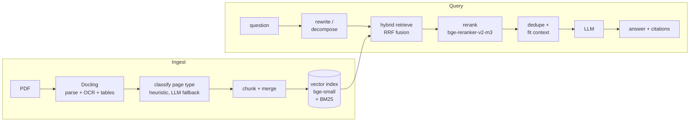
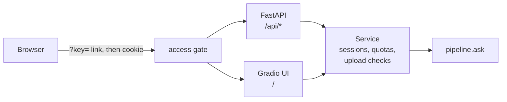

# docuchat

Upload PDFs, ask questions, get answers that cite the page they came from.

The result that matters most: adding a cross-encoder reranker took the hit rate
on my 43-question test set from 0.61 to 0.76. Hybrid search alone did almost
nothing for ranking. The [Results](#results) section has the full ablation.

## Live demo

**https://redesigned-sniffle-7jvqgj6qp7vcx97g-7860.app.github.dev/**

No key needed. Ask about the sample mortgage documents, or upload your own
PDF (up to 10 MB, 30 pages).

Fair warning: it may not work when you try it. I can't pay for an API key or a
server, so the whole thing runs on free tiers. Answers come from Gemini's free
tier, which gives me about 20 questions a day and throws "high demand" errors
a lot. When Gemini fails, the app falls back to Qwen3 1.7B running on the
Codespace's CPU. That answer is slower and noticeably dumber, but you get one.
The app itself lives in a GitHub Codespace, which goes to sleep when nobody's
using it, so if the page doesn't load at all, that's why. [Running it
locally](#run-it) with your own key always works.

## How it works



BM25 and vector search each pull candidates, reciprocal rank fusion merges
them, and a cross-encoder picks the ones that actually answer the question.
The model only sees that retrieved context. It cites file and page, and it
says "I don't know" when the documents don't cover the question.

Every pipeline choice is a field on `Settings`. An ablation arm is one
`dataclasses.replace()`, so each result in the tables below traces back to
exactly one change.

The app is one process with two front doors, a REST API and a Gradio UI, and
both go through the same service layer:



The access gate is optional. The public demo runs with it off.

## Results

The test set is 43 questions over 15 public CFPB mortgage documents, each
labeled with the pages that hold the answer. Brackets are 95%
bootstrap confidence intervals.

### Retrieval

Three arms, each adding one thing to the one before.

| arm | hit | recall | MRR | candidate recall |
|---|---|---|---|---|
| baseline (vector only) | 0.632 [0.474, 0.789] | 0.575 [0.430, 0.719] | 0.355 [0.234, 0.483] | 0.706 [0.579, 0.820] |
| +hybrid (add BM25) | 0.605 [0.474, 0.737] | 0.583 [0.439, 0.724] | 0.315 [0.203, 0.448] | 0.829 [0.724, 0.921] |
| +rerank (add cross-encoder) | **0.763** [0.632, 0.895] | **0.715** [0.583, 0.847] | **0.512** [0.379, 0.634] | 0.829 [0.724, 0.921] |

Adding BM25 got the right page into the candidate pool more often (0.71 to
0.83) but didn't rank it any higher; MRR actually dipped. The reranker is what
cashed that in. The demo serves the `+rerank` arm. Full output:
[`eval/results/summary.md`](eval/results/summary.md).

### Answer quality

Same questions, answered by Qwen3 8B and graded by Qwen3 14B, both local GGUFs
via llama.cpp on a free Kaggle T4
([`eval/kaggle_eval.ipynb`](eval/kaggle_eval.ipynb)). `full` adds LLM query
rewriting and decomposition on top of `+rerank`, and the last two rows each
swap one thing in `full`.

| arm | correct | mean correctness (0–2) | faithful | false refusals |
|---|---|---|---|---|
| baseline | 0.698 [0.558, 0.814] | 1.651 [1.488, 1.814] | 0.744 [0.628, 0.860] | 0.211 [0.079, 0.342] |
| +hybrid | 0.698 [0.558, 0.814] | 1.558 [1.326, 1.744] | 0.744 [0.605, 0.860] | 0.158 [0.053, 0.263] |
| +rerank | 0.674 [0.535, 0.814] | 1.581 [1.372, 1.767] | 0.698 [0.558, 0.837] | 0.105 [0.026, 0.211] |
| full (+ query rewrite/decompose) | 0.698 [0.558, 0.837] | 1.628 [1.441, 1.791] | 0.721 [0.581, 0.860] | **0.079** [0.000, 0.184] |
| full, generic profile | 0.721 [0.581, 0.860] | 1.628 [1.419, 1.814] | 0.721 [0.581, 0.860] | 0.105 [0.026, 0.211] |
| full, bge-base embedder | **0.767** [0.628, 0.884] | **1.744** [1.581, 1.884] | **0.814** [0.674, 0.930] | 0.132 [0.026, 0.263] |

Better retrieval shows up mostly as fewer wrong refusals, 0.21 down to 0.08.
Correctness sits around 0.70 for every retrieval arm, so at this size the 8B
answering model is the bottleneck, not retrieval. All arms refused every
unanswerable question.

The bge-base embedder row is the one I can't call yet. It wins every answer
metric, but its intervals overlap `full`'s, and the judge is a 14B model I
never checked against hand labels. I'd want a stronger judge before switching
the default. Treat this table as arms compared with each other, not as
absolute scores. Full output:
[`eval/results/judged_summary.md`](eval/results/judged_summary.md).

### Latency

Measured over HTTP against the demo setup: a 4-core CPU Codespace with Gemini
3.7 Flash (free tier) answering. Milliseconds.

| stage | p50 | p95 |
|---|---|---|
| retrieve | 35 | 36 |
| rerank | 3,280 | 3,309 |
| clean_context | 3,090 | 3,119 |
| llm | 12,402 | 19,130 |
| total (server) | 18,863 | 25,535 |
| end-to-end (client) | 18,945 | 25,705 |

About 19 seconds per question, most of it waiting on Gemini. On that CPU the
default `bge-reranker-v2-m3` took 125–130 s per question, so the demo swaps in
`cross-encoder/ms-marco-MiniLM-L-6-v2` at 512 tokens through two environment
variables. The quality numbers above use the default reranker. The sample is
small (1 cold request, 3 warm) because Gemini's free tier rejected the rest.
Details: [`eval/results/latency.md`](eval/results/latency.md).

## Run it

Python 3.11+.

```bash
python -m venv .venv && source .venv/bin/activate
pip install -e ".[dev]"
```

Put one LLM key in a `.env` at the repo root (it's gitignored):

```bash
ANTHROPIC_API_KEY=...          # default provider
# or
GEMINI_API_KEY=...
DOCUCHAT_LLM_PROVIDER=gemini
```

Any `Settings` field can be set the same way, as `DOCUCHAT_<FIELD>`.

Start the server. The UI is at http://localhost:7860 and the API is under
`/api`:

```bash
uvicorn docuchat.api:app --env-file .env --port 7860
```

With no key, the app still starts and uploads still index, but questions come
back "LLM not configured." Set `DOCUCHAT_ACCESS_KEY` to turn on the access
gate; visitors then need a `?key=` link.

To get the local fallback the demo uses, run `pip install -e ".[local-llm]"`
and point `DOCUCHAT_GGUF_PATH` at a Qwen3 GGUF. When the API call fails, the
local model answers instead. `DOCUCHAT_LLM_PROVIDER=llamacpp` skips the API
entirely.

With Docker (the models are baked into the image, so it starts offline):

```bash
docker build -t docuchat .
docker run --rm -p 7860:7860 --env-file .env docuchat
```

Tests (the fast suite; integration tests are opt-in with `-m integration`):

```bash
pytest
```

## Evaluate and benchmark

```bash
python -m docuchat.evaluate ingest --profile mortgage   # rebuild eval/nodes/ snapshots
python -m docuchat.evaluate run                         # all arms (needs an LLM key)
python -m docuchat.evaluate run --judge                 # + answer quality from the judge
python -m docuchat.bench --url <url> --key <key>        # writes eval/results/latency.md
```

Results land in `eval/results/`. The questions are in
[`eval/questions.yaml`](eval/questions.yaml), and the corpus and its sources
are in [`eval/corpus/`](eval/corpus/SOURCES.md).

## Deploy

The demo runs in a GitHub Codespace. I start the server as in
[Run it](#run-it) and set port 7860 to public in the Ports tab.
`DOCUCHAT_DAILY_QUERY_CAP` and `DOCUCHAT_DAILY_UPLOAD_CAP` limit how much a
public link can spend.

## Repo layout

```
src/docuchat/
  config.py      Settings: every pipeline knob, env-overridable
  ingest.py      Docling PDF parsing
  classify.py    page-type classification
  chunking.py    chunking and merging
  index.py       vector + BM25 index
  retrieval.py   hybrid retrieval with RRF
  rerank.py      cross-encoder reranking
  pipeline.py    ask(): the query path, with per-stage timings
  models.py      LLM / embedding / reranker clients
  profiles.py    domain profiles (mortgage, generic)
  service.py     sessions, quotas, upload checks, local-model fallback
  api.py         FastAPI app, access gate, Gradio mount
  ui.py          Gradio UI
  evaluate.py    evaluation harness
  judge.py       LLM judge
  bench.py       HTTP latency benchmark
eval/            corpus, questions, node snapshots, results
tests/
Dockerfile
```
