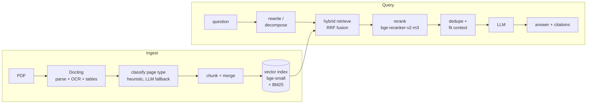
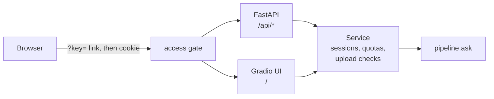

# docuchat

Upload PDFs, ask questions, get answers that cite the page they came from.

> **Status:** the service, UI, and Docker image are done and tested. The live
> demo link, the answer-quality numbers, and the latency table are coming soon
> (they wait on LLM API keys).

## Why it's built this way

- **Hybrid retrieval, then a reranker.** BM25 and vector search find
  candidates; a cross-encoder decides which ones answer the question. The
  evaluation below shows the reranker is where the quality comes from.
- **Grounded answers.** The model answers only from retrieved context, cites
  file and page, and refuses when the documents don't contain the answer.
- **One config seam.** Every pipeline choice is a field on `Settings`, so each
  ablation arm is a single `dataclasses.replace()` and every result is
  attributable to one change.
- **Measured, not claimed.** A 43-question ground-truth set over 15 public
  CFPB mortgage documents, with bootstrap confidence intervals.

## Architecture



How it's served: one process, one service layer, two front doors.



## Results

Retrieval quality on 43 questions, three arms, each adding one thing to the
last. Brackets are 95% bootstrap confidence intervals.

| arm | hit | recall | MRR | candidate recall |
|---|---|---|---|---|
| baseline (vector only) | 0.632 [0.474, 0.789] | 0.575 [0.430, 0.719] | 0.355 [0.234, 0.483] | 0.706 [0.579, 0.820] |
| +hybrid (add BM25) | 0.605 [0.474, 0.737] | 0.583 [0.439, 0.724] | 0.315 [0.203, 0.448] | 0.829 [0.724, 0.921] |
| +rerank (add cross-encoder) | **0.763** [0.632, 0.895] | **0.715** [0.583, 0.847] | **0.512** [0.379, 0.634] | 0.829 [0.724, 0.921] |

Hybrid search puts the right evidence into the candidate pool more often
(candidate recall 0.71 → 0.83), but on its own it doesn't rank it higher. The
reranker is what turns that pool into better top results: hit rate 0.61 → 0.76
and MRR 0.32 → 0.51. The served app runs the `+rerank` arm. Full output:
[`eval/results/summary.md`](eval/results/summary.md).

### Answer quality — coming soon

Correctness, faithfulness, and refusal rates from an LLM judge. Filled in by
`python -m docuchat.evaluate run --judge`.

### Latency — coming soon

p50/p95 per pipeline stage against the deployed Space. Filled in by
`python -m docuchat.bench --url <space-url> --key <key>`.

## Demo — coming soon

A short recording of uploading a PDF and asking questions about it.

## Run it

Python 3.11+.

```bash
python -m venv .venv && source .venv/bin/activate
pip install -e ".[dev]"
```

Put one LLM key in a `.env` at the repo root (it's gitignored):

```bash
ANTHROPIC_API_KEY=...          # default provider
# or
GEMINI_API_KEY=...
DOCUCHAT_LLM_PROVIDER=gemini
```

Any `Settings` field can be overridden the same way, as `DOCUCHAT_<FIELD>`.

Start the server. The UI is at http://localhost:7860, the API under `/api`:

```bash
uvicorn docuchat.api:app --env-file .env --port 7860
```

Without a key the app still starts and uploads still index; questions answer
"LLM not configured." Set `DOCUCHAT_ACCESS_KEY` to turn on the access gate.

With Docker (models are baked into the image, so startup is offline):

```bash
docker build -t docuchat .
docker run --rm -p 7860:7860 --env-file .env docuchat
```

Tests (the fast suite; integration tests are opt-in with `-m integration`):

```bash
pytest
```

## Evaluate and benchmark

```bash
python -m docuchat.evaluate ingest --profile mortgage   # rebuild eval/nodes/ snapshots
python -m docuchat.evaluate run                         # all arms (needs an LLM key)
python -m docuchat.evaluate run --judge                 # + answer quality from the judge
python -m docuchat.bench --url <url> --key <key>        # writes eval/results/latency.md
```

Results land in `eval/results/`. The questions are in
[`eval/questions.yaml`](eval/questions.yaml); the corpus and its sources are in
[`eval/corpus/`](eval/corpus/SOURCES.md).

## Deploy

The app runs on a Hugging Face Docker Space, private behind a link:

1. Create a Docker Space and set its secrets: an LLM key and
   `DOCUCHAT_ACCESS_KEY`.
2. In this GitHub repo, add the `HF_TOKEN` secret and the `HF_SPACE` variable
   (`user/space-name`).
3. Run the **deploy** workflow from the Actions tab.
4. Share `https://<user>-<space>.hf.space/?key=<access key>`. The first visit
   sets a cookie and strips the key from the URL; anyone without it gets 403.

Daily query and upload caps (`DOCUCHAT_DAILY_QUERY_CAP`,
`DOCUCHAT_DAILY_UPLOAD_CAP`) bound the spend if the link leaks.

## Repo layout

```
src/docuchat/
  config.py      Settings: every pipeline knob, env-overridable
  ingest.py      Docling PDF parsing
  classify.py    page-type classification
  chunking.py    chunking and merging
  index.py       vector + BM25 index
  retrieval.py   hybrid retrieval with RRF
  rerank.py      cross-encoder reranking
  pipeline.py    ask(): the query path, with per-stage timings
  models.py      LLM / embedding / reranker clients
  profiles.py    domain profiles (mortgage, generic)
  service.py     sessions, quotas, upload checks
  api.py         FastAPI app, access gate, Gradio mount
  ui.py          Gradio UI
  evaluate.py    evaluation harness
  judge.py       LLM judge
  bench.py       HTTP latency benchmark
eval/            corpus, questions, node snapshots, results
tests/
Dockerfile
.github/workflows/deploy.yml
```
